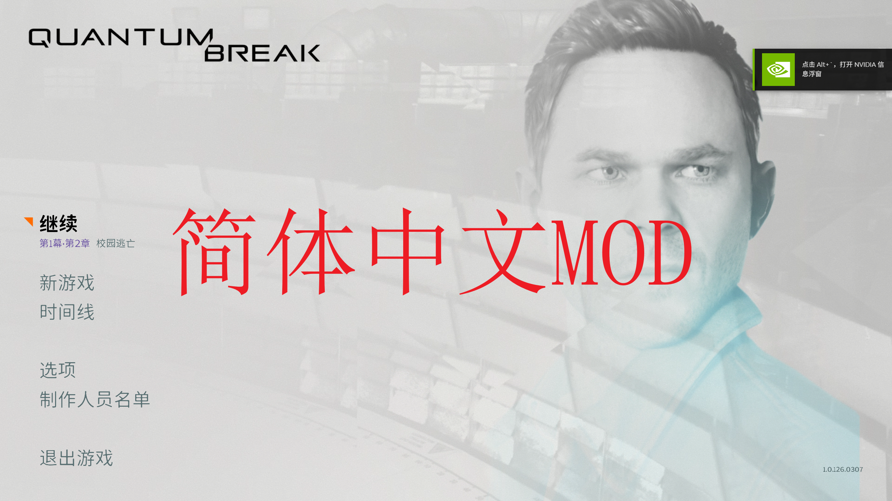
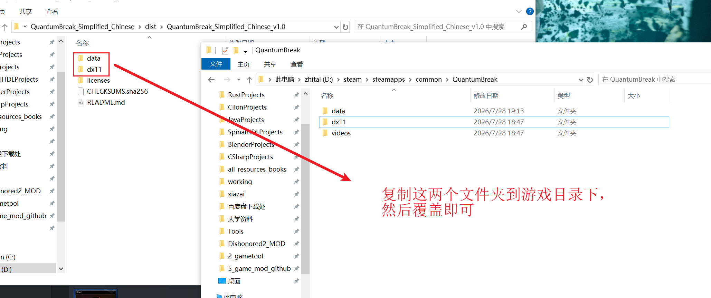

<div align="center">

# 《量子破碎》简体中文翻译

### Complete Simplified Chinese Translation for Quantum Break

完整简体中文翻译 MOD，覆盖菜单、界面、剧情对白、字幕、动态按键提示、中文字体以及 Steam PC 专用图形选项。

</div>

<p align="center">
  
</p>

## 下载

请前往本仓库的 [Releases](https://github.com/intergra/QuantumBreak_Simplified_Chinese/releases) 页面下载作者上传的 `QuantumBreak_Simplified_Chinese.zip`。

> 请下载 Release 页面中由作者单独上传的 MOD 压缩包。GitHub 自动生成的
> `Source code (zip)` 和 `Source code (tar.gz)` 不是可安装的 MOD。

## Overview / 简介

本 MOD 为 Steam 版《Quantum Break / 量子破碎》制作完整简体中文翻译，覆盖菜单、
界面、系统提示、任务目标、剧情对白、角色标签、过场字幕、Previously On 剧集字幕、
收集品与世界观文本，并包含重新构建的简体中文字体资源。

翻译以英文原文、剧情语境和实际玩法为主要依据，官方中文资源仅作参考。项目并非简单
“繁转简”，而是对人物口吻、剧情术语、玩法提示和 UI 表达进行了统一与润色，使文本
更符合简体中文玩家的阅读习惯。

本 MOD 沿用游戏原生中文语言槽和 Northlight 资源结构：

- 无需修改 `QuantumBreak.exe`；
- 无需 DLL 注入、Hook 或额外启动器；
- 不修改剧情事件、关卡逻辑或游戏机制；
- 安装后选择游戏原有的“Chinese / 中文”即可生效；
- 内置简体中文文本、字幕与字体资源。

## Important Notes / 重要说明

1. 本 MOD 主要面向 Steam 版 PC / DX11 游戏制作和测试。
2. 不会新增独立的“简体中文”选项，而是替换游戏原有中文资源。
3. 安装后必须在游戏语言设置中选择 **“Chinese / 中文”**。
4. 安装前请备份需要覆盖的三个原版文件。
5. 本 MOD 不包含游戏本体，使用前必须拥有并安装正版游戏。

## Main Features / 主要内容

### 1. 完整简体中文界面与菜单

覆盖主菜单、暂停菜单、设置、加载、章节选择、系统提示、任务目标、时间能力说明以及
错误与确认信息。游戏原有的占位符、动态控制标记和按键结构均予以保留，降低文本错位、
按键框变形和提示显示异常的风险。

### 2. 剧情对白与游戏内字幕

覆盖主要角色对白、场景对话、电话与无线电通讯、战斗喊话、环境对白、任务提示、说话人
标签和采访字幕。译文结合人物关系与剧情语境进行润色，避免生硬直译、语义缺失和角色
口吻不一致。

### 3. Previously On 剧集字幕

包含 6 组简体中文字幕，覆盖剧集回顾、章节剧情总结和关键事件说明。字幕时间码、cue
顺序和文件结构均经过检查，确保能够按游戏原有字幕链路加载。

### 4. 术语与文本一致性

对人物、组织、时间能力和核心剧情概念进行了统一，例如：

- Time Stutter → 时间跳针
- End of Time → 时间的尽头
- Lifeboat Protocol → 救生艇计划
- Monarch Solutions → 莫纳克集团
- Junction → 分歧点
- Chronon Dampener → 时元抑制器
- Jack Joyce → 杰克·乔伊斯
- Paul Serene → 保罗·瑟林

同一术语在菜单、对白、字幕和世界观文本中尽量保持一致。

### 5. 简体中文字体

从官方 Northlight 中文字体资源重新构建简体中文字形，保留原版字符框、基线、字距和
按键布局，并对字体粗细、清晰度和重叠风险进行调整。

中文、拉丁字母、数字和中英文标点使用协调的字形风格；Enter、Tab、Space 等按键标签
仍适配原版按键框。控制器图标、箭头和游戏私用图标不会被普通字符替换。

### 6. Steam PC 专用图形选项

部分 Steam PC 图形设置文本位于 `dx11/loc_x64_f.dll`，不在普通语言包中。本 MOD 对
其中已确认的本地化字符串进行简体中文修正，包括“胶片颗粒”“图像升级”等选项。

该 DLL 不是注入模块或外挂程序，仅替换已知的文本字符串槽，不修改游戏代码、事件逻辑
或渲染逻辑。

## Package Contents / 文件内容

正式发布包主要包含：

```text
data/ep999-000-zh.bin
data/ep999-000-zh.rmdp
dx11/loc_x64_f.dll
licenses/LICENSE.md
licenses/LICENSE-SourceHanSans.txt
```

发布包不包含游戏本体、`QuantumBreak.exe`、脚本、启动器、注入工具或后台程序。

## Translation Principles / 翻译原则

1. 优先遵循英文原文的真实语义。
2. 结合剧情、场景、人物身份和实际玩法进行翻译。
3. 统一人物、组织、时间能力和关键剧情术语。
4. 官方中文资源仅作参考，不机械照搬繁体表达。
5. 保留占位符、动态控制标记和原有文本结构。

## Recommended Environment / 推荐环境

- 游戏：Steam 版 Quantum Break
- 平台：Windows PC / DX11
- 游戏语言：Chinese / 中文
- 建议不要同时安装其他中文文本、字幕或字体 MOD

如果此前安装过其他汉化或测试语言包，建议先通过 Steam 验证游戏文件完整性。

## Installation / 安装方法

安装前请彻底退出游戏。

1. 解压 `QuantumBreak_Simplified_Chinese.zip`；压缩包根目录直接包含 `data`、`dx11` 和 `licenses`。
2. 打开 Quantum Break 游戏安装目录，备份 `data/ep999-000-zh.bin` 和 `data/ep999-000-zh.rmdp`。
3. 将发布包根目录中的 `data` 文件夹复制到游戏根目录并确认覆盖。
4. 备份游戏 `dx11/loc_x64_f.dll`。
5. 将发布包根目录中的 `dx11` 文件夹复制到游戏根目录并确认覆盖。
6. 启动游戏，在语言设置中选择 **“Chinese / 中文”**。



游戏中仍会显示原有的“Chinese / 中文”选项，不会新增“Simplified Chinese”语言项。

## Updating / 更新方法

1. 关闭游戏并备份当前文件。
2. 如使用过其他资源结构，先通过 Steam 验证游戏文件完整性。
3. 按照安装步骤覆盖三个文件。
4. 启动游戏并确认语言设置为“Chinese / 中文”。

不要混用不同 Release 中的语言包或 DLL 文件。每个版本的具体变化只记录在对应的
GitHub Release 中。

## Uninstallation / 卸载方法

1. 关闭游戏。
2. 恢复备份的三个原版文件。
3. 如果没有备份，在 Steam 游戏属性中选择“已安装文件”。
4. 执行“验证游戏文件的完整性”，等待 Steam 恢复原版资源。

> 请勿在没有备份的情况下直接删除游戏目录中的语言包或 DLL 文件。

## Compatibility / 兼容性说明

- 按 Steam 版 PC / DX11 游戏文件制作和测试。
- 不建议与其他会修改中文文本、字幕、字体或 `loc_x64_f.dll` 的 MOD 同时使用。
- 不修改关卡流程、角色属性、敌人 AI、武器数值或存档结构。
- 其他平台和不同游戏构建未经完整验证。

## Technical Safety / 技术安全说明

- 不修改 `QuantumBreak.exe`，不包含注入、Hook、脚本或启动器。
- 语言包沿用游戏原生 Northlight 中文资源结构。
- DLL 仅用于已确认的 Steam PC 本地化字符串，不修改游戏代码。
- 不替换配音、音乐，不改变剧情事件或游戏机制。

## Known Notes / 已知说明

- 安装后仍需手动选择“Chinese / 中文”语言。
- 若仍显示英文或繁体，请检查语言设置及其他 MOD 冲突。
- 如果游戏文件曾被手动修改，建议先通过 Steam 验证完整性。
- 不同游戏构建可能导致语言包或 DLL 不兼容。
- 自动化资源检查不能完全代替所有系统环境下的实机测试。

## Credits / 制作信息

**制作人：** NoWindNoMoon / 此情无关风月

**简体中文字形：** Source Han Sans SC / 思源黑体简体

字体依据 SIL Open Font License 1.1 使用。第三方版权与许可详情见
[THIRD_PARTY_NOTICES.md](THIRD_PARTY_NOTICES.md)，完整字体许可证随正式发布包提供。

游戏名称、原始文本、图像、音频和其他资产归其各自权利人所有。本 MOD 是非官方、
非商业的玩家制作项目，与 Remedy Entertainment、Microsoft 或其他相关权利人没有
隶属、认可或赞助关系。使用本 MOD 必须拥有通过合法渠道取得的游戏副本。

本仓库采用[自定义使用许可](LICENSE.md)。允许玩家下载、安装和免费传播完整、未经修改的
官方发布包；不得销售、收费分发、公开发布修改版或进行商业利用。第三方字体内容继续
遵循其各自许可证。

## Support / 赞赏支持

如果这个项目对您有帮助，欢迎打赏支持，您的每一份支持都是我持续更新的动力!

<table>
  <tr>
    <td align="center" width="50%">
      <br>
      <strong>支付宝赞赏</strong>
    </td>
    <td align="center" width="50%">
      <br>
      <strong>微信赞赏</strong>
    </td>
  </tr>
</table>

## Feedback / 反馈

如果你在游玩过程中发现繁体或英文残留、字幕缺失、文本截断、字体异常、按键提示错位、
翻译语义问题或安装异常，请在本仓库的
[Issues](https://github.com/intergra/QuantumBreak_Simplified_Chinese/issues) 中反馈。

请尽量提供游戏平台、游戏语言设置、问题所在章节或菜单、截图，以及是否同时安装了其他
本地化 MOD。

感谢每一位测试和反馈问题的玩家。

## Repository Scope / 仓库范围

本仓库是面向玩家的公开发布仓库，只保存长期有效的 README、许可、第三方声明、公开图片、
tag 和 GitHub Release 信息。

完整译文、字幕源、字体构建源、构建脚本、测试、审计报告和内部维护记录保存在独立的构建
仓库中，不以本仓库作为构建输入。正式 ZIP 由构建仓库中最终验证通过的 commit 生成，只
作为对应 GitHub Release 的手动附件，不提交进本仓库的 Git 历史。

版本更新摘要只写在对应的 GitHub Release 中；README 不保存“当前版本”或某个具体版本的
更新列表。正式 Release 发布后保持冻结，如需修正则进入下一个版本。